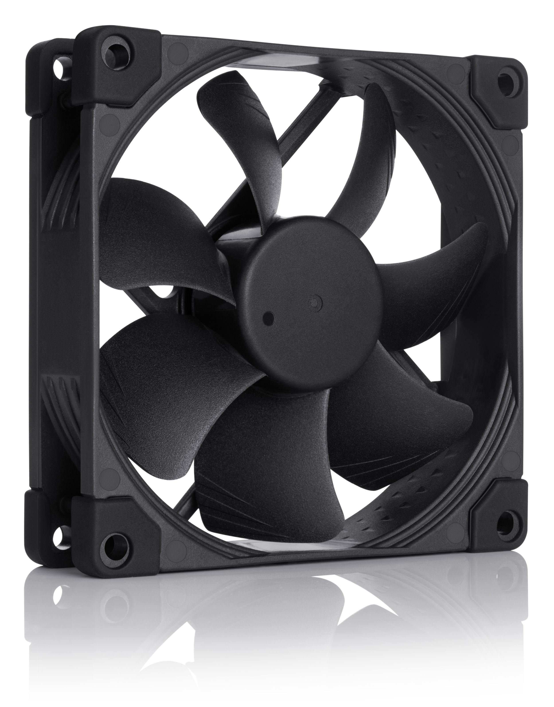
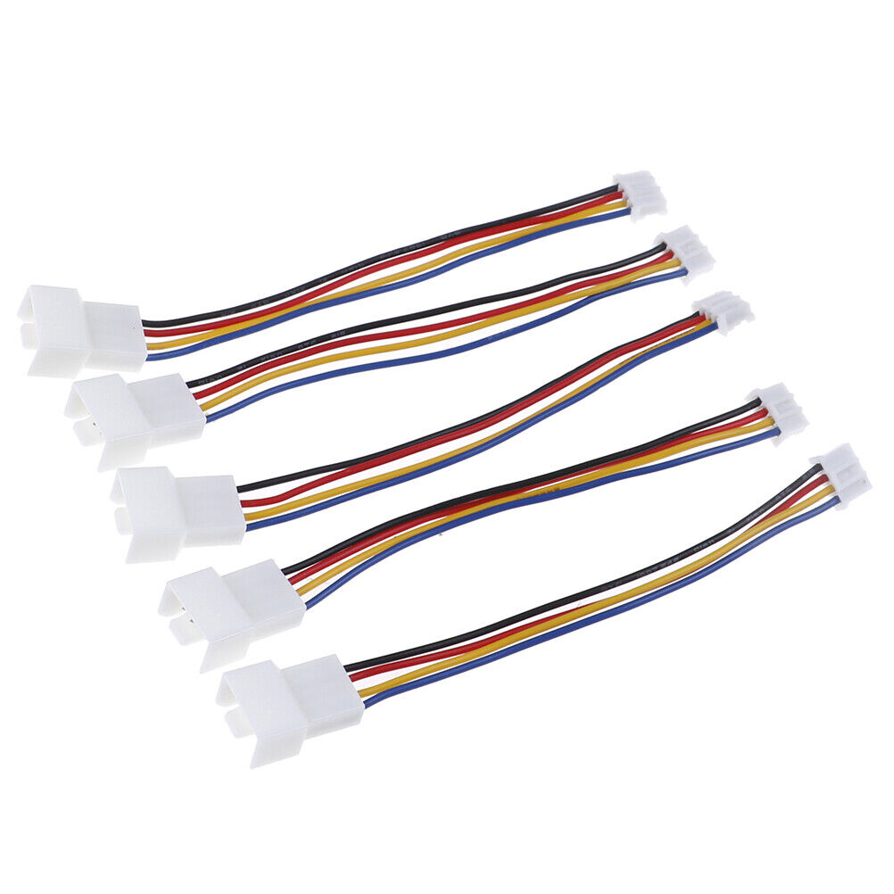

# Gigabyte RTX 2060 Super

## Stock specifications

|                 |                                                 |
| --------------- | ----------------------------------------------- |
| GPU model       | [Gigabyte GeForce RTX 2060 SUPER GAMING OC 3X 8G](https://www.gigabyte.com/Graphics-Card/GV-N206SGAMING-8GC) |
| Stock fan count | 3                                               |

## Bill of materials

- 3 Noctua NF-A9 PWM chromax.black.swap
- Arctic 4-Pin PWM Fan Splitter Cable (to daizy cain the fans)
- 4-Pin PWM adapter to small 4-Pin (to connect the fans to the GPU mainboard)
- 4 black fan screws

